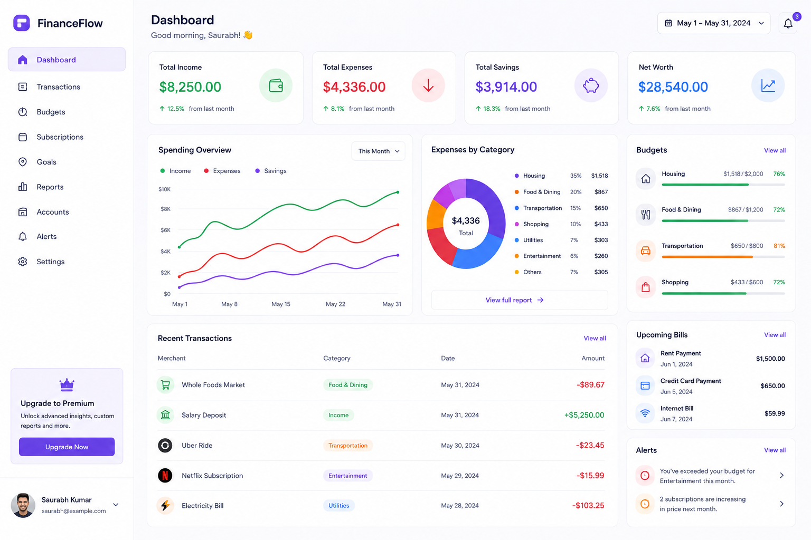

# FinanceFlow

FinanceFlow is a personal finance dashboard built with React, Vite, React Router, Recharts, and Tailwind CSS. It presents a polished overview of spending, budgets, bills, transactions, and alerts using mock data so the UI can be explored immediately.

## Features

- Dashboard overview with summary cards and charts
- Budget tracking and spending insights
- Transaction history and upcoming bills view
- Alerts panel and responsive sidebar navigation
- Mock-driven data layer that is easy to replace with a real API later

## Quick Start

### Prerequisites

- Node.js 18+ recommended
- npm 9+

### Installation

```bash
git clone <your-fork-or-repo-url>
cd FinanceFlow
npm install
npm run dev
```

Then open http://localhost:5174 in your browser.

### Production build

```bash
npm run build
npm run preview
```

The preview server will start from the Vite build output so you can inspect the production bundle locally.

## Project Structure

```text
FinanceFlow/
├── public/                # Static assets and screenshots
├── src/
│   ├── assets/            # Images, icons, and shared visual assets
│   ├── components/        # Reusable UI components
│   ├── data/              # JSON mock data for dashboard sections
│   ├── hooks/             # Custom hooks that load and shape data
│   ├── layouts/           # Layout wrappers and shared page shells
│   ├── pages/             # Route-level page components
│   ├── routes/            # Router config and route components
│   ├── App.jsx            # App entry component
│   └── main.jsx           # React/Vite bootstrap
├── index.html             # HTML entry for Vite
├── package.json           # Scripts and dependencies
├── vite.config.js        # Vite configuration with the dev server port
└── README.md              # Project documentation
```

## Screenshots

A dashboard preview is included in the repository for quick reference:




## Tech Stack

- React 19
- Vite 8
- React Router
- Recharts
- Tailwind CSS 4
- Lucide React

## Development Notes

- The app currently uses local JSON fixtures and custom hooks under [src/hooks](src/hooks) to simulate data loading.
- The Vite dev server is configured to run on port 5174.
- If you want to add a backend later, this frontend is already structured so the data layer can be swapped for real API calls without major UI rewrites.

## FastAPI Roadmap

A future backend version is planned around FastAPI. The intended direction is:

- Build a FastAPI service for authentication, transactions, budgets, and bills
- Expose REST endpoints such as /api/transactions and /api/budgets
- Replace the current mock hooks with real network requests from the frontend
- Add PostgreSQL or SQLite persistence for long-term finance tracking

This keeps the current React experience intact while making it easier to evolve into a full-stack finance application.

## Contribution Workflow

- Create a feature branch using the convention: feat/TASK-XXX-description
- Make your changes and test them locally
- Open a pull request against main
